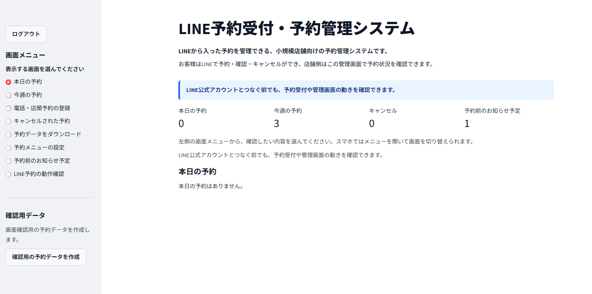
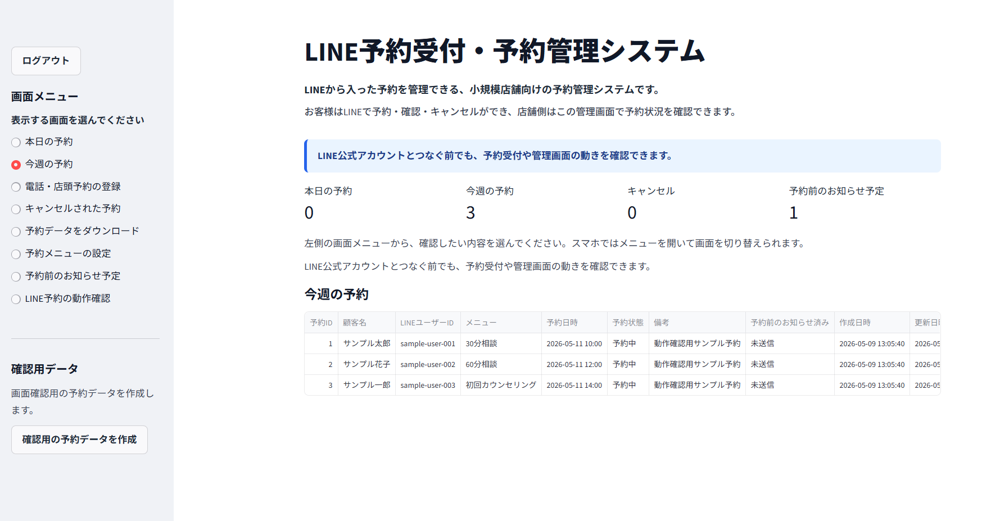
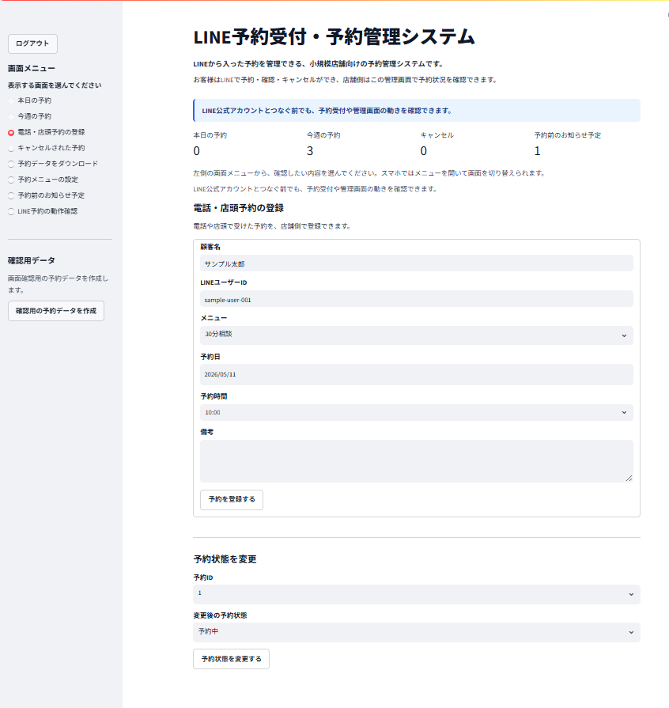
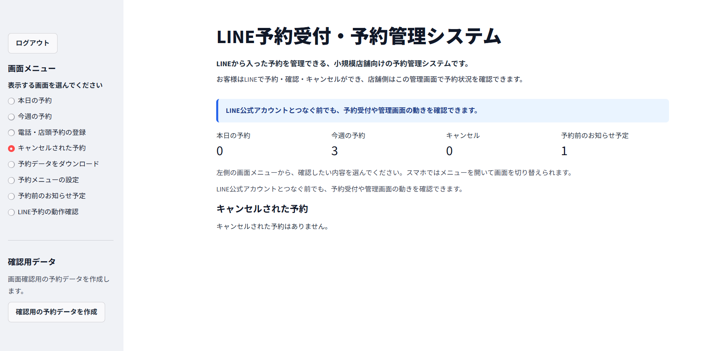
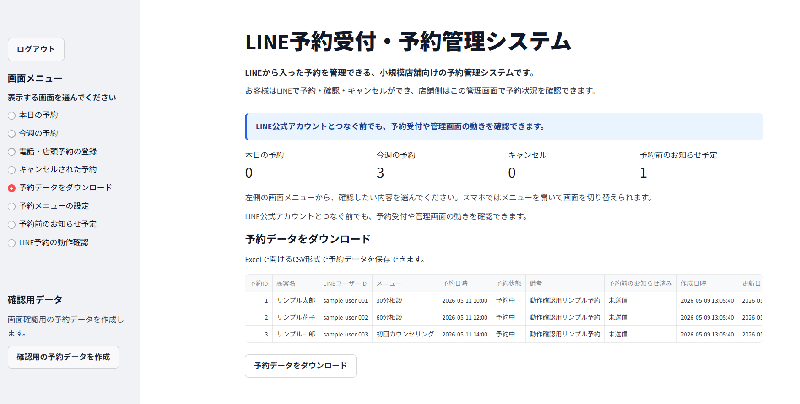
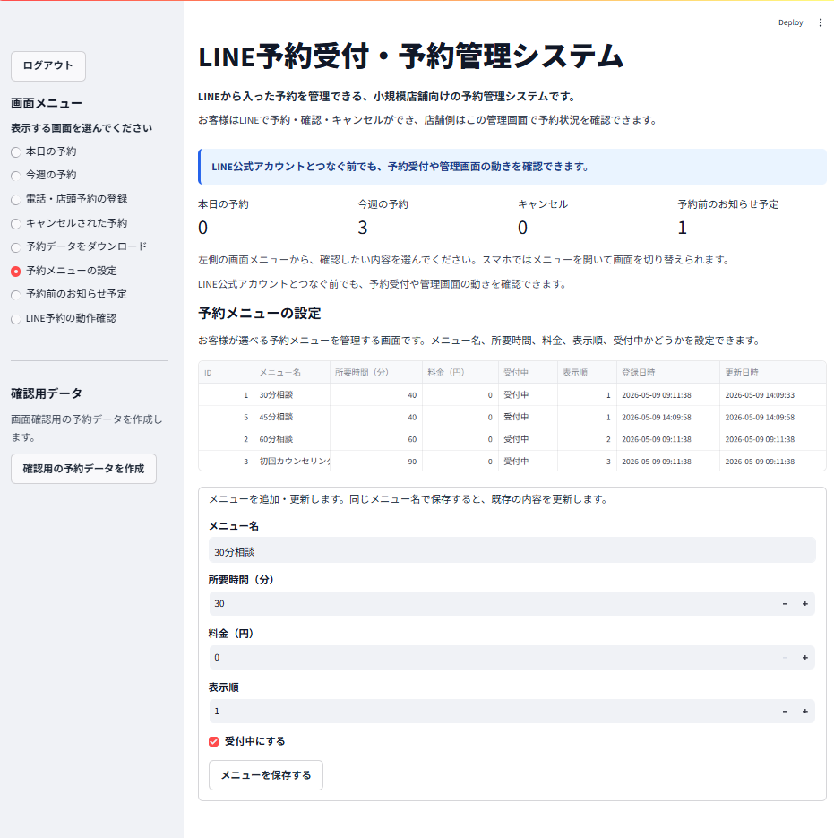
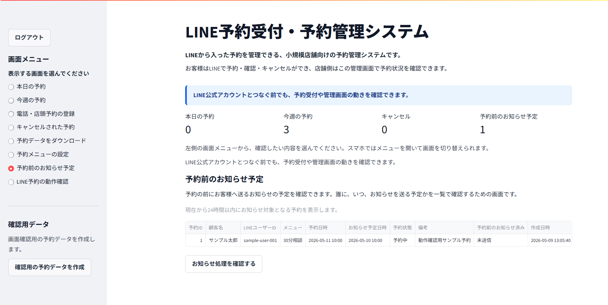
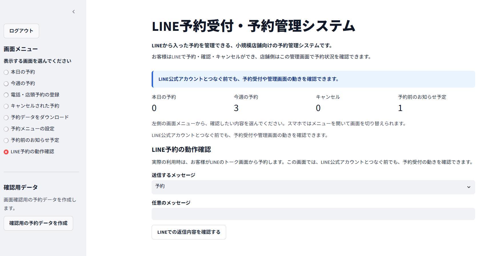

# ReserveLine Pro：LINE予約受付・予約管理システム

ReserveLine Proは、美容室、整体院、個人レッスン、士業相談、カウンセリングなどの小規模事業者向けに、LINEでの予約受付・確認・キャンセル・予約前のお知らせを想定した予約管理システムです。

店舗側は管理画面から予約状況を確認でき、電話や店頭で受けた予約の登録、キャンセル管理、予約データのダウンロードも行えます。

FastAPIでWebhook受信用APIを実装し、Streamlitで管理画面を提供します。LINE公式アカウントやMessaging APIをまだ接続していない状態でも、予約受付の流れ、管理画面、予約データのダウンロード、予約前のお知らせ予定の確認を行えます。

`.env` はGitHubに公開しないファイルです。LINE APIキー、チャネルシークレット、管理者パスワードなどの秘密情報は `.env` に保存し、コードには直書きしないでください。

## 画面イメージ

ReserveLine Proの管理画面では、予約状況の確認、電話・店頭予約の登録、予約メニューの設定、予約データのダウンロード、LINE予約の動作確認ができます。

### 管理画面トップ



### 本日の予約



### 今週の予約



### 電話・店頭予約の登録



### 予約データをダウンロード



### 予約メニューの設定



### 予約前のお知らせ予定



### LINE予約の動作確認



## 主な機能

- LINEでの予約受付
- メニュー一覧の表示
- 直近予約の確認
- 直近予約のキャンセル
- 電話・店頭予約の登録
- 予約状態の変更
- 本日の予約・今週の予約表示
- キャンセルされた予約の表示
- 予約データをダウンロード
- 予約メニューの設定
- 予約前のお知らせ予定表示
- 確認用の予約データ作成
- LINE公式アカウントとつなぐ前でも確認できる予約受付の動作確認

## 管理画面の主な画面

### 予約メニューの設定とは

お客様が選べる予約メニューを登録・編集する画面です。メニュー名、所要時間、料金、表示順、受付中かどうかを管理できます。

### 予約前のお知らせ予定とは

予約したお客様へ、予約前に送るお知らせの予定を確認する画面です。誰に、いつ、お知らせを送る予定かを確認できます。

## 予約チェック

予約登録時に次をチェックします。

- 過去日時の予約不可
- 営業時間外の予約不可
- 定休日の予約不可
- 同じ日時に有効な予約がある場合の重複予約不可

## 技術構成

- Python 3.11以上
- FastAPI
- Streamlit
- SQLite
- APScheduler
- python-dotenv
- pytest

## 関連ドキュメント

- [製品概要](docs/product_overview.md)
- [操作マニュアル](docs/operation_manual.md)
- [動作確認シナリオ](docs/demo_scenario.md)
- [変更履歴](CHANGELOG.md)

## 初回セットアップ（Windows PowerShell）

PowerShellでプロジェクトフォルダへ移動します。

```powershell
cd "C:\Users\あなたのユーザー名\Desktop\reserveline-pro"
```

フォルダ名に日本語やスペースが含まれる場合は、パス全体を " " で囲んでください。

仮想環境を作成します。

```powershell
python -m venv .venv
```

Python Launcherでバージョンを指定する場合は、インストール済みのPython 3.11以上を指定してください。

```powershell
py -3 -m venv .venv
```

仮想環境を有効化します。

```powershell
.\.venv\Scripts\Activate.ps1
```

実行ポリシーのエラーが出る場合は、同じPowerShellで次を実行してから再度有効化してください。

```powershell
Set-ExecutionPolicy -Scope Process -ExecutionPolicy Bypass
.\.venv\Scripts\Activate.ps1
```

ライブラリをインストールします。

```powershell
pip install -r requirements.txt
```

設定ファイルを作成します。既存の `.env` がある場合は上書きしないでください。

```powershell
copy .env.example .env
```

## .env の設定

管理画面ログイン用の `ADMIN_PASSWORD` は必ず変更してください。

```env
DEMO_MODE=true
ADMIN_PASSWORD=change-me
BUSINESS_OPEN_TIME=09:00
BUSINESS_CLOSE_TIME=18:00
BUSINESS_DAYS=mon,tue,wed,thu,fri,sat
BUSINESS_TIMEZONE=Asia/Tokyo
```

PowerShellで `.env` を書き換える場合は、UTF-8で保存してください。

```powershell
(Get-Content -Encoding UTF8 .env) -replace '^ADMIN_PASSWORD=.*$', 'ADMIN_PASSWORD=1234' | Set-Content -Encoding UTF8 .env
```

LINE Messaging APIに接続する場合だけ、次を `.env` に設定します。

```env
DEMO_MODE=false
LINE_CHANNEL_ACCESS_TOKEN=LINEのチャネルアクセストークン
LINE_CHANNEL_SECRET=LINEのチャネルシークレット
```

LINEアクセストークン、チャネルシークレット、管理者パスワードはコードに直接書かないでください。

## 管理画面の起動

```powershell
streamlit run ui/admin_app.py
```

ブラウザで管理画面が開きます。最初に「管理画面ログイン」が表示されるので、`.env` の `ADMIN_PASSWORD` を入力してください。

バッチファイルでも起動できます。

```powershell
.\run_admin.bat
```

## APIの起動

```powershell
uvicorn app.main:app --reload --host 127.0.0.1 --port 8000
```

起動後、次のURLで確認できます。

```text
http://127.0.0.1:8000
http://127.0.0.1:8000/health
```

バッチファイルでも起動できます。

```powershell
.\run_api.bat
```

## LINE公式アカウントとつなぐ前に予約受付の動きを確認する

APIを起動した状態で、別のPowerShellから実行します。

```powershell
Invoke-RestMethod -Method Post `
  -Uri http://127.0.0.1:8000/webhook `
  -ContentType "application/json" `
  -Body '{"user_id":"sample-user-001","display_name":"サンプル太郎","message":"予約"}'
```

予約登録の例です。

```powershell
Invoke-RestMethod -Method Post `
  -Uri http://127.0.0.1:8000/webhook `
  -ContentType "application/json" `
  -Body '{"user_id":"sample-user-001","display_name":"サンプル太郎","message":"予約 30分相談 2026-05-15 10:00"}'
```

確認とキャンセルも試せます。

```powershell
Invoke-RestMethod -Method Post `
  -Uri http://127.0.0.1:8000/webhook `
  -ContentType "application/json" `
  -Body '{"user_id":"sample-user-001","display_name":"サンプル太郎","message":"確認"}'

Invoke-RestMethod -Method Post `
  -Uri http://127.0.0.1:8000/webhook `
  -ContentType "application/json" `
  -Body '{"user_id":"sample-user-001","display_name":"サンプル太郎","message":"キャンセル"}'
```

管理画面のサイドバーにある「確認用の予約データを作成」を押すと、画面確認用の予約データを作成できます。既に同じ確認用の予約がある場合は重複登録しません。

## テスト実行

```powershell
python -m compileall app ui
python -m pytest -q
```

## 今後の拡張

ReserveLine Proは現在、LINE予約受付・予約管理の基本機能を備えています。今後は、LINE公式アカウントとの本番接続、ボタン式予約、予約変更、予約前のお知らせ通知、予約枠設定の強化などを追加していく予定です。

管理画面では、予約ルールの設定、営業日・営業時間・予約間隔・臨時休業日の管理、日付とメニューを指定した空き時間の確認ができます。

詳細は [docs/productization_plan.md](docs/productization_plan.md) を参照してください。

## 安全面について

- APIキーや管理者パスワードは `.env` で管理します。
- `.env` やローカルDBはGitHubに公開しない設定にしています。
- 本番利用時は、LINE公式アカウントの設定、HTTPS環境、アクセス制限を行ってください。

## 今後の拡張案

- LINE Flex Messageによるボタン式の予約受付
- Googleカレンダー連携
- 空き枠カレンダー表示
- スタッフ別予約管理
- 顧客別予約履歴
- LINE Push通知による予約前のお知らせ送信
- 複数店舗対応
- 管理者ロール管理
